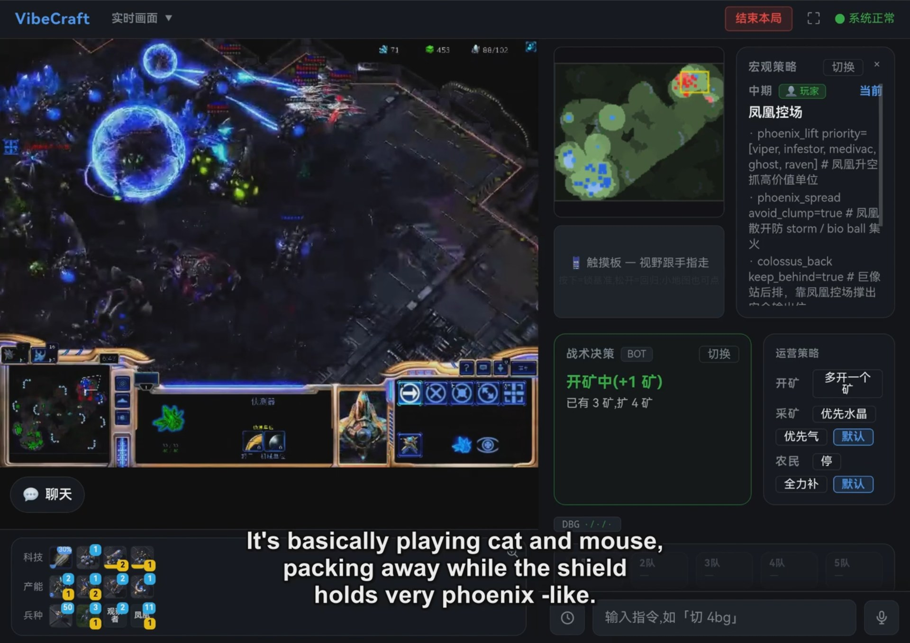
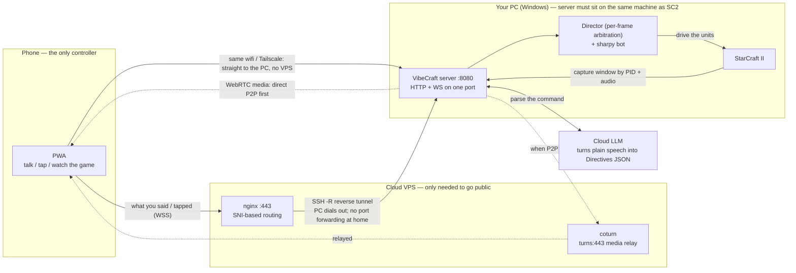

# VibeCraft

> **English** · [中文](README.md)

**Talk or type — an AI plays StarCraft II for you. Built for veterans whose strategy is
still sharp but whose hands aren't.**

You can still read a StarCraft II game. Your hands just can't keep up anymore. VibeCraft lets you
issue **strategy and micro commands from your phone** (typing, your phone's voice keyboard, or
push-to-talk in the app) while an AI bot does every click: workers, supply, expansions, unit
production, attacks, and basic combat. You watch, you judge, you give orders at the moments that
matter — **you are the commander, the AI is your Adjutant.**



*The cockpit on a phone, in landscape, during a real game. Left: the live SC2 view — drag anywhere
to move the camera. Right, top to bottom: **macro strategy** (this player picked the Phoenix-control
doctrine, and its parameters are laid out for you), **the bot's current tactical decision** (it is
taking a fourth base right now, and it tells you why), and **economy toggles** (gas priority, worker
production — flip them mid-game). Along the bottom: tech, production and army at a glance, plus the
command box and the push-to-talk key. Frame taken from the [demo videos](#demo-videos), hence the
burned-in subtitles.*

> **Good fit:** returning veterans who lost the mechanics but kept the game sense; playing a few
> games with old friends without an APM contest.
> **Not a fit:** ladder players chasing APM; complete newcomers to SC2.

> **Unofficial fan project.** Not affiliated with Blizzard. You must own a legitimate copy of
> StarCraft II; this repository distributes no game files. Use is governed by Blizzard's
> *StarCraft II AI and Machine Learning License* (non-commercial research / AI use only) and the
> SC2 EULA. See [THIRD_PARTY_NOTICES.md](THIRD_PARTY_NOTICES.md). The MIT license here covers
> VibeCraft's own source code only.

> **Want to run it yourself? Check these first** — miss any one and you'll get stuck:
> - A **Windows 10/11** PC (audio capture + PowerShell scripts are Windows-only for now)
> - **StarCraft II** installed and launched at least once
> - **Python 3.11** — exactly 3.11, *not* "3.11 or newer" — and [**uv**](https://docs.astral.sh/uv/).
>   The vendored sharpy needs `sc2pathlib`, which upstream ships only as a `cp311-win_amd64`
>   binary; on 3.12 everything installs fine and then fails at runtime.
> - A **`DEEPSEEK_API_KEY`** environment variable (the LLM parses your commands; bring your own
>   pay-as-you-go key). Without it, voice/text commands fail to parse. See
>   [Part 2 — Self-hosting](#part-2--self-hosting).
> - Contributing? See [CONTRIBUTING.md](CONTRIBUTING.md).

This document is organised by audience:

- [Part 1 — Players: how to play](#part-1--players-how-to-play)
- [Part 2 — Self-hosting](#part-2--self-hosting) (local one-click script / public internet)
- [Part 3 — Developers: architecture](#part-3--developers-architecture)

---

## Demo videos

Seven episodes showing it in action (English AI-dub over the original Chinese commentary, subtitles
burned in). [**Full playlist**](https://www.youtube.com/playlist?list=PLX4yIrCbhGJs):

1. [Playing SC2 with my voice: 4-Gate with a proxy, all from my phone](https://youtu.be/HFqAZ_KWm1U)
2. [Protoss openings, real-time tactics, and a Dark Templar harass called out loud](https://youtu.be/rHetKwC7AN0)
3. [Voice-made control groups, proxy Stargates, and a Void Ray harass](https://youtu.be/9-YHQI1aMDM)
4. [Two players, two phones, one PC: a voice-controlled 1v1 (Protoss vs Terran)](https://youtu.be/2vyl0IE68UM)
5. [Terran Battlecruiser opener with auto-harass, commanded entirely by voice](https://youtu.be/VMZ6jxJ0WBo)
6. [4-Rax proxy Marine rush and a fast Battlecruiser](https://youtu.be/H8fw4bA_qDE)
7. [Zerg Nydus Worm rush, called out loud, on a new widescreen UI](https://youtu.be/cQTZ-2fd7lg)

---

# Part 1 — Players: how to play

### The easy case: someone else is hosting

Open the host's link **in your phone's browser** → enter a nickname → pick the server → connect.
You're in the cockpit. Nothing to install. (Want to host? See
[Part 2](#part-2--self-hosting).)

### What it feels like

```
  Phone (your only controller — never touch the PC's keyboard/mouse)
   │  1. Entry page: nickname + pick server → connect
   │  2. Lobby: pick race / ready up / host starts (multiplayer)
   ▼  3. Cockpit
  ┌──────────────────────────────────────────────┐
  │ Live SC2 video + game-state snapshot          │
  │ Push-to-talk bar / text input                 │
  │ Army-wide buttons: Attack · Defend · Retreat  │
  │ Command cards (cancel any with ×)             │
  │ Minimap (drag to move camera) + macro panel   │
  │ + control-group bar                           │
  └──────────────────────────────────────────────┘
```

### Division of labour

| | You | The AI |
|---|---|---|
| Economy (workers / supply / gas / expansions) | — | 100% handled |
| Buildings & unit production | You set direction | Executes the build strictly |
| Basic combat (focus fire, stutter step, retreat) | — | Automatic, decent |
| Strategy (attack timing, tech switches, where to expand) | **This is your job** | Conservative by default |
| Hard micro (Archon merge, force fields, storms, blink) | **You must order it** | Won't use it on its own |

Out of the box the bot beats Medium AI and goes roughly even with Hard. The more you engage, the
higher it climbs.

### What you can order

**Cockpit UI**

| Control | What it does |
|---|---|
| Army-wide buttons | Attack / Defend / Retreat (a persistent stance applied to free units) |
| Command card × | Every order you give becomes a card — cancel it any time |
| Minimap drag | Move the in-game camera |
| Push-to-talk | Hold and speak (in-app speech recognition), or use your phone's voice keyboard |
| Text input | Type the order directly |
| **Language toggle (中/EN)** | Top-right; UI, command parsing and speech recognition all switch, and it persists |
| Macro panel / control groups / production panel | Switch builds, view groups 1–5, adjust production |

**Voice / text commands — everything the bot actually understands**

Below is the full set of command types the bot **really executes**, with real example phrasings.
Just talk normally; there's no syntax to memorise. If something is ambiguous the bot asks a
clarifying question. For anything with **"here" / "this spot"**, first drag the minimap so the
camera is on the target — "here" means *the centre of your current camera*, and the bot reads the
coordinates. Every order becomes a **command card with an × to cancel**.

The four levels at a glance, then the details:

| Level | Scope | Examples |
|---|---|---|
| L1 macro strategy | The whole game plan (a "build") | "go 4-gate", "switch to two-base phoenix", "transition to skytoss" |
| L2 army tactics | Posture of the whole army | "attack their natural", "everyone retreat", "hold this position" |
| L3 unit / group tasks | Specific units doing specific jobs | "DTs guard the gas, don't move", "group 1 void rays attack their third", "send a probe to build a pylon at the front" |
| L4 production / economy | Units, buildings, upgrades, expansions | "make 4 zealots", "add 8 gateways", "research blink first", "steal an expansion here" |

---

**① Switch build / macro plan (L1)**

| Say | Effect |
|---|---|
| "go 4-gate", "switch to two-base phoenix", "transition to skytoss", "go carriers" | Switches to that build; the bot follows its unit/building order (40+ builds across all three races — see the library below) |
| "cancel the build", "stop following the build", "stop making units" | The bot falls back to conservative macro: workers and defence only, no attacks |

**② Army-wide stance (L2 — the three big cockpit buttons)**

| Say | Effect |
|---|---|
| "attack their natural", "A-move their third", "everybody push" | Committed attack on that area (fight it out) |
| "poke their natural", "push up and see", "probe forward" | Probing attack: take what's free, back off if it stalls |
| "all-in", "throw everything at them", "no retreat" | All-in commit, never retreats |
| "defend", "everyone home", "hold one wave" | Whole army falls back to defend the main |
| "stay defensive", "keep holding" | Keeps the defensive stance after the wave is over |
| "full retreat", "pull everything back", "go home" | Everyone retreats (plain move — won't stop to fight) |
| "hold here", "stand your ground", "wall the ramp", "hold the third" | Clump up at a point and hold, without going home |

> Army-wide orders only affect **free units**. Units you individually claimed or put in a control
> group are untouched — cancel that claim (or disband the group) first if you want them to obey.

**③ Sending units out: attacks, harassment, recon-in-force (L2–L3)**

| Say | Effect |
|---|---|
| "send 5 phoenixes to harass their main", "mutas harass their top expansion" | That many units go harass (**you must give a count for harassment**, otherwise the bot asks) |
| "phoenixes come back after killing 5 workers" | Harassment with an exit condition |
| "recon in force on their third", "push 4 stalkers forward and look" | A small force probes: it pulls back on profit, heavy losses, or timeout |
| "pull the damaged stalkers back", "bring the void rays with broken shields home" | Select units by state (low HP / shields down) |
| "retreat the front stalker", "the frontmost zealot comes back", "the immortal in the back steps up" | Select by **physical position** (frontmost / rearmost) |

**④ Standby / rally / guard / hold (L3)**

| Say | Effect |
|---|---|
| "send a worker here on standby", "zealots wait at their third" | Move there and stay; fights back if attacked and returns afterwards (persists until ×) |
| "gather all void rays here", "bring the zealots together here" | Clump **existing** units at one point and hold them there (waiting for your next order) |
| "DTs guard the gas, don't move" | Pin in place (hold position, no chasing) |
| "2 stalkers guard the 5 o'clock expansion" | Guard an area (fights back, then returns) |
| "send a stalker to the left watchtower" | Take a watchtower |
| "park a worker at their bottom-right expansion" | Sit somewhere for vision (compass directions and clock positions both work) |

**⑤ Patrol (back and forth, L3)**

| Say | Effect |
|---|---|
| "worker patrols between their 11 o'clock and their third" | Continuous patrol between two points |
| "3 phoenixes patrol between our natural and their main" | Multi-unit patrol line |

**⑥ Rally point (for units built later, L3)**

| Say | Effect |
|---|---|
| "set the rally point here", "new units gather here" | Sets a **global rally**: units produced from now on go there (existing units unaffected) |

> Difference: "gather the *X* here" moves **existing** units (④); "rally point" governs where
> **future** units go (⑥).

**⑦ Voice control groups (1–5, L3)**

| Say | Effect |
|---|---|
| "make the warp prisms group 1" | Puts those units in group 1 (the group bar shows members) |
| "put 2 workers in group 3" | Only that many join |
| "new void rays automatically join group 1" | Standing recruitment: newly built units auto-join |
| "group 1 attack their third", "group 3 retreat" | Order a group directly |
| "release group 2", "clear group 2" | Disband the group, units return to the bot |

**⑧ Scouting / vision (L2–L3)**

| Say | Effect |
|---|---|
| "take a look at their main", "scout their natural" | Sends one unit; the job ends once it has vision |
| "keep an eye on their main", "maintain vision of the natural" | A unit keeps that area revealed |
| "send a probe to scout 11 o'clock" | A specific unit scouts a direction / clock position |
| "bring the scouting worker home" | Recalls the scouting worker (back to mining) |
| "stop scouting, go take the right watchtower" | **Reassigns** the scout to a new job instead of sending it home |

**⑨ Units / buildings / upgrades / pausing production (L4)**

| Say | Effect |
|---|---|
| "make 2 sentries", "build 4 zealots", "2 zealots and 3 stalkers" | Queue that many units (the card clears when done) |
| "warp 2 zealots to the front", "warp 3 stalkers to the natural" | Warp new units directly to a location |
| "add a forge", "add two stargates", "one more assimilator" | Incremental building (**+N** on top of what you have) |
| "get to 8 gateways", "make it 14 gateways" | Build up to an absolute total |
| "2 assimilators at the natural", "2 cannons and a forge at the ramp" | Buildings at a specified place |
| "research blink first", "upgrade ground attack", "add a cyber core then air upgrades" | Research upgrades ("attack + armour" does both lines) |
| "stop making stalkers for now", "pause zealot production" | Pause a unit line (resumes when you × the card) |

**⑩ Proxy / forward buildings (send a worker out, L3–L4)**

| Say | Effect |
|---|---|
| "send a worker to build a pylon at the front" | One worker goes, can't be pulled away, and stays there afterwards |
| "send a worker to their 6 o'clock to build a pylon, then a gateway next to it" | Chained: pylon first, then the follow-ups inside its power field |
| "send a worker here for a pylon, then two stargates" | "here" = current camera; one worker builds them all in order |
| "add one more stargate there" | Reuses the worker already out there for one more building |

> Protoss rule: follow-up buildings must sit in a pylon's power field, so proxy chains always go
> **pylon first, buildings after** — the bot spaces them so they don't collide.

**⑪ Hidden expansions (L4)**

| Say | Effect |
|---|---|
| "steal an expansion here", "start a hidden base here" | Move the camera onto the target patch first — ~16 workers go mine there and flee if attacked |
| "steal an expansion here with more workers" | Adjust worker count (default 16, max 24) |
| "steal it but skip the gas" | Minerals only |

> Difference: "take a third" is normal expansion (⑫); "steal an expansion" plants a hidden mining
> camp in a blind spot or a far corner.

**⑫ Expanding (L4)**

| Say | Effect |
|---|---|
| "expand here", "put a nexus down here" | Look at a mineral patch and say it — a worker goes and expands there |
| "take another base", "expand", "take a third" | No location — the bot picks the next expansion itself |

**⑬ Hard ability casts (you must order these, L3)**

| Say | Effect |
|---|---|
| "chrono the two forges", "chrono the stargate" | Nexus chrono boost on a building |
| "merge all high templars into archons", "make 2 archons" | Archon merges |
| "storm their main" | High templar psionic storm (needs a target) |
| "blink the stalkers into their main" | Stalker blink (requires the upgrade) |
| "stim the marines" (Terran), "abduct their carrier" (Zerg) | Per-race abilities |

**⑭ Camera follow (moves the camera only, L3)**

| Say | Effect |
|---|---|
| "follow the main army" | Camera tracks the army centroid |
| "follow the stalkers", "watch that phoenix" | Follow a unit type |
| "follow the harassment squad" | Follow the current scouting / harassment group |
| "follow the scouting worker", "follow the one on the watchtower" | Follow by **job**, not by unit type |

**⑮ Multi-step chains (L3)**

| Say | Effect |
|---|---|
| "worker goes to the right watchtower, then their 11 o'clock, then builds a pylon at their natural, then comes home to mine" | One worker walks the steps in order; each completion triggers the next |

**⑯ Releasing units**

| Say | Effect |
|---|---|
| "that zealot comes back", "release all void rays" | Cancels every in-flight order on those units and hands them fully back to the bot |

**⑰ Salvage (Terran, refunds part of the cost, L5)**

| Say | Effect |
|---|---|
| "salvage the bunker", "tear down that bunker" | Salvages your own building (bunker / sensor tower); non-salvageable ones get a friendly refusal |

**⑱ Camera box-select ("the X on screen", works across command types)**

| Say | Effect |
|---|---|
| "put the stalkers on screen into group 2", "everything on screen attack here", "salvage the bunkers on screen" | Only affects units/buildings **visible in the camera at the moment you speak** |

> Move the camera there first. Different from "here" (a *location*) — "the X on screen" selects a
> *batch*, and the two can be combined in one sentence.

**Naming conventions:** the Chinese UI uses SC2 hotkey abbreviations for buildings and community
slang for units. In English, plain unit and building names work ("stalker", "gateway", "cyber
core"), as does standard community shorthand ("4-gate", "skytoss", "12-pool", "IAC"). Naming a
unit or building that isn't in your race gets a friendly refusal.

### Player control model (four rules)

1. **Unit-level orders are exclusive and last-write-wins** — a new order on an already-controlled
   unit takes it over.
2. **Army-wide orders never touch claimed units** — they apply to free units only. Cancel the
   claim or disband the group first.
3. **Releasing or disbanding a unit cancels every in-flight order on it** and hands it back.
4. **Retreat uses a plain move** (won't stop to fight), never attack-move.

**Priority pyramid:** no orders from you → the bot decides everything; whatever you lock down, the
bot leaves alone while still running the rest; cancel your order → autonomy flows back.

### Build library (40+ across three races)

- **Protoss:** 4bg (4-gate), 1g_robo_immortal, iac_2base, immortal_archon, colossus_immortal,
  blink_stalker, blink_harass, dt_rush, phoenix_2base, skytoss, void_ray_rush, cannon_rush …
- **Terran:** one_one_one, two_one_one, bio_stim, mech, two_base_tanks, banshee_harass,
  marine_rush, liberator, widow_mine_drop, ghost_nuke, bc_late …
- **Zerg:** 12pool, macro_hatch, zvp_macro, ling_bane, muta_ling_bane, roach_hydra, roach_ravager,
  lurker_hydra, mutalisk_harass, nydus, ultralisk, brood_corruptor …

---

# Part 2 — Self-hosting

You want to host for your friends. Two setups: **local** (you and your friends on the same wifi,
or on Tailscale) and **public internet** (phones connect directly, no Tailscale needed). The
server code is identical — the only difference is how the phone reaches your PC.

### How the three pieces fit together

**Solid lines are the control plane** (web page, signalling, your commands — tiny amounts of
traffic). **Dashed lines are the media plane** (game video and audio, PC to phone — the bulk of it):



Three things worth internalising:

- **The server always lives on the same PC as StarCraft II** and cannot move to the cloud — it
  launches and drives the game, and captures that machine's screen by window PID.
  **The cloud does exactly one job: connect your phone to your PC.**
- **The VPS is optional.** On the same wifi, or with Tailscale on both ends, the phone talks to
  the PC directly (the bottom edge in the diagram). You only need a VPS when a friend is on
  mobile data and you don't want to ask them to install Tailscale.
- **Media avoids the VPS when it can.** WebRTC tries a direct P2P path first and only falls back
  to the TURN relay if that fails — so the VPS usually costs very little bandwidth.

## A. Local (Windows) — the one-click script

### Step 0: prerequisites

- **StarCraft II installed and launched at least once** (so
  `Documents\StarCraft II\ExecuteInfo.txt` records the install path and the script can find it).
- Put the ladder map (default `DaybreakLE`) into `<SC2 install>\Maps\`.
- Install [`uv`](https://docs.astral.sh/uv/) and set up an LLM API key.

### Step 1: the setup script ⭐

From the repo root, in PowerShell:

```powershell
.\scripts\setup-windows.ps1
```

It handles (idempotent, safe to re-run):

1. **Locates StarCraft II** (SC2PATH → `ExecuteInfo.txt` → registry → common paths) and
   **persists `SC2PATH`**. If it can't find it, you'll be told to launch SC2 once or set it
   manually.
2. **Fixes "the stream goes black when idle"**: never turn off the display / never sleep on AC
   power, screensaver off. (Root cause: Windows turns the display off → SC2 stops rendering → the
   capture grabs black frames.)
3. Checks `uv` and `DEEPSEEK_API_KEY`, with instructions if either is missing.

> If it still goes black, it may be the Windows **lock screen** (different from display-off) —
> disable auto-lock separately.

### Step 2: install and run

```powershell
# sc2-lib is not optional: the bot itself needs python-sc2 and the vendored sharpy's deps.
# With only `dev`, the server starts fine and then dies with an ImportError once a game begins.
uv sync --extra dev --extra sc2-lib            # first time / when deps change
uv run python scripts/download_sc2_icons.py    # fetch SC2 icons (first time; copyrighted art is not
                                               # shipped in this repo — see THIRD_PARTY_NOTICES)
.\scripts\start.ps1 -Token vibecraft-dev       # start the server (prints a QR code + URL)
# Optional: pre-fetch the English ASR model if you'll have English speakers
# (~1 GB, ~6 min the first time, cached afterwards)
.venv\Scripts\python.exe scripts\prefetch_asr_en.py
```

Phone **on the same wifi**: scan the QR code or open the URL. For remote play without a public
server: install **Tailscale** on both ends and connect over the Tailnet.

## B. Public internet (with a cloud VPS)

A cloud VPS acts as **media relay + public front door**; your PC sits behind NAT and makes an
**outbound** connection to it. Architecture diagram:
[`ARCHITECTURE.md`](ARCHITECTURE.md).

**1) Get a VPS** — see [`docs/ops/vps-purchase-spec.md`](docs/ops/vps-purchase-spec.md):
2 vCPU / 2 GB, Ubuntu 22.04, ≥30 Mbps, unmetered or generous traffic, a public IP.

**2) Install the relay + front door on the VPS** (copy the scripts over, run in order, substitute
your own IP/domain):

```bash
bash setup-coturn.sh        # coturn: STUN/TURN + turns:443 + short-term credentials + SSRF guards
bash setup-frontdoor.sh     # nginx 443 SNI routing (turn.* → coturn / app.* → reverse tunnel) + certs
```

**3) Configure the PC and open the reverse tunnel**:

```powershell
# a. Fill in .secrets\vibecraft-turn.env (copy from deploy\turn\vibecraft-turn.env.example):
#    TURN_DOMAIN / TURN_STATIC_SECRET (on the VPS: cat /etc/vibecraft-turn-secret) / ports
# b. Open the PC → VPS reverse tunnel (auto-reconnects):
.\deploy\turn\pc-tunnel.ps1
# c. Start the server (reads the TURN config from .secrets; without it, falls back to plain P2P):
.\scripts\start.ps1 -Token <room-token>
```

Phones connect to `https://app.<your-ip>.sslip.io/?room=<room-token>`: the control plane goes
nginx → reverse tunnel → your PC; media prefers P2P and falls back to `turns:443` relay.

**4) Cost — the variable is bandwidth**

The VPS runs coturn + nginx + an SSH tunnel; **CPU and RAM are nearly idle**. The real cost driver
is egress traffic, and that depends entirely on whether video goes **P2P or through the relay**:

| Media path | When | VPS traffic |
|---|---|---|
| **P2P direct** (bypasses the VPS) | Same wifi, **phone has Tailscale**, or NAT traversal succeeds | **≈ 0** (signalling only, kilobytes) |
| **TURN relay** (everything through the VPS) | Both ends behind CGNAT and P2P fails (common on home broadband) | video bitrate × duration |

Relay traffic is essentially all video: ~1–2 Mbps by default (`-Quality` mode runs 15 fps and is
cheaper; bad networks auto-degrade). One viewer ≈ **0.7–1 GB/hour**; two phones ≈ **1.5–2 GB/hour**.
At two hours a day, solo, that's ≈ **40–60 GB/month**.

**How to keep it cheap**

- **Install Tailscale on the phone** → media goes direct over the Tailnet and **skips TURN**
  entirely; the VPS degrades to a pure signalling front door.
- On the **same wifi**, just use the LAN URL (`http://<PC LAN IP>:8080`) — no VPS at all.
- If you really need the relay, use `-Quality` to cut the frame rate.

---

# Part 3 — Developers: architecture

In one sentence: **phone command → LLM parses it into Directives JSON (the single intermediate
representation) → the Director arbitrates every frame → SC2 is driven through sharpy hooks;
SC2 video and audio stream back to the phone over WebRTC.**

```
Phone PWA ──WS──► server (on the PC)
   │  command text / speech → LLM → Directives JSON
   ▼
Director (ticks every frame) ──► Directive Board (arbitration / priority / activation gates)
   ├─► sharpy BuildOrder / Act (build steps, production, upgrades)
   │     Rationale Log / ViewController / BuildLocationOverride)
   ├─► sharpy combat plans (vendored fork; player-override hooks live inside the plans)
   └─► Sc2Facade ──► python-sc2 ──► SC2 client
   ▲
   └── SC2 video/audio ──WebRTC (per-PID screen + audio capture)──► phone
```

**Stack**

| Layer | Tech |
|---|---|
| Bot / engine | sharpy-sc2 (vendored fork), python-sc2 (BurnySc2), Python 3.11 |
| Intermediate representation | pydantic Directives + alias YAML + build YAML |
| Realtime media | aiortc (WebRTC video + audio; per-PID capture, WASAPI process loopback) |
| Signalling / web | websockets (HTTP + WS on one port), Vue 3 + Tailwind PWA |
| Speech recognition | Chinese: FunASR `paraformer-zh-streaming` (streaming); English: `SenseVoiceSmall` (offline, ~1 GB, pre-fetch with `scripts/prefetch_asr_en.py`) |
| Relay / public access | coturn (TURN over TLS:443) + nginx (SNI front door) + SSH reverse tunnel |
| LLM | Cloud, provider-configurable (currently DeepSeek V4 over the Anthropic-compatible endpoint) |
| Logging | structlog JSONL — every LLM call, every directive entering/leaving the Board, every hook firing |

**Key ideas:** the `LLM_CONTROLLED` role makes the base bot skip those units so player orders win;
complex actions are composed from **existing directives chained by `activate_when` gates** rather
than new directive types; multiplayer is one SC2 client with multiple host/join instances plus a
`Room` state machine, per-player WS routing, and a per-player WebRTC connection (each capturing its
own SC2 window by PID).

> **Full module map, runtime data flow, invariants, hook mapping, and deployment diagrams:**
> [`ARCHITECTURE.md`](ARCHITECTURE.md).

### Development commands

```bash
uv sync --extra dev                                # dev dependencies
uv run pytest                                      # unit tests (mocked, no SC2 needed)
uv run pytest -m integration                       # integration layer (mocked python-sc2)
uv run ruff check . && uv run mypy src/vibecraft   # lint + strict typing
uv run python scripts/download_sc2_icons.py        # fetch SC2 icons (not shipped; see THIRD_PARTY_NOTICES)
cd web && npm run build                            # build the PWA (outputs to server/static)
```

burnysc2 isn't on PyPI — `uv sync --extra sc2-lib` pulls it from git for you.

**Real-game self-verification** (mocked LLM, non-realtime, several can run in parallel):

```bash
.venv/Scripts/python.exe scripts/build_acceptance.py <strategy_id> --opponent veryeasy
.venv/Scripts/python.exe scripts/override_acceptance.py <case_id> --opponent veryeasy
.venv/Scripts/python.exe scripts/multiplayer_selftest.py
```

> **A note on what counts as verified in this project:** passing unit tests and a green internal
> trace are *not* evidence that something works in-game. For anything that issues commands to SC2,
> the bar is **observable end-state in the world** (telemetry counts changing, the engine's own
> `ActionResult`), not "our code logged that it tried". See [`CLAUDE.md`](CLAUDE.md).

### Layout

```
src/vibecraft/
  directives/  # Directive models + Board (the single intermediate representation)
  strategy/    # build library + YAML schema + alias resolution
  dsl/         # condition DSL (activate_when / done_when)
  llm/         # intent parser + provider abstraction
  bot/         # VibeCraftBot (sharpy subclass) + Director + auto_combat (all three races)
  server/      # WS+HTTP service + WebRTC + ASR + multiplayer rooms + PWA static
  logging_/    # structured JSONL logging
web/           # Vue 3 + Tailwind PWA source (built into server/static)
strategies/    # build YAML (protoss / terran / zerg)
deploy/turn/   # public deployment scripts (coturn / nginx front door / reverse tunnel)
scripts/       # setup-windows / start / self-verification scripts
vendor/sharpy/ # sharpy fork (player-override hooks live inside the combat plans)
tests/{unit,integration,e2e}/
```

### Documentation map

| Document | Contents |
|---|---|
| [`ARCHITECTURE.md`](ARCHITECTURE.md) | Module map / data flow / invariants / hooks / deployment diagrams |
| [`USER_GUIDE_EN.md`](USER_GUIDE_EN.md) | Player guide, example phrasings, FAQ (English) |
| [`TASKS.en.md`](TASKS.en.md) | What's next — the public roadmap and where to start |
| [`CONTRIBUTING.md`](CONTRIBUTING.md) | Dev setup, conventions, how to submit changes |
| [`SECURITY.md`](SECURITY.md) | Reporting vulnerabilities + this project's threat model |
| [`CLAUDE.md`](CLAUDE.md) | Working conventions (also the AI-collaboration context file) |
| [`CHANGELOG.md`](CHANGELOG.md) | Version history |

> The design documents (the master design doc, ADRs, the reasoning graph) are written in Chinese.

---

## Contact

- **Bugs, feature ideas, usage questions** → open an
  [issue](https://github.com/catmaniii/vibecraft/issues). Prefer this — public answers help the
  next person.
- **Security vulnerabilities** → don't open a public issue; see [`SECURITY.md`](SECURITY.md).
- **Anything else** (code-of-conduct reports, licensing, private contact) →
  **vibecraftproject@gmail.com**.

Issues and PRs in English are welcome — the maintainer's first language is Chinese, so replies
may be brief, but you won't be ignored. Please read [`CONTRIBUTING.md`](CONTRIBUTING.md) and
[`CODE_OF_CONDUCT.md`](CODE_OF_CONDUCT.md) before contributing.

---

## Acknowledgements

VibeCraft is built on other people's work. These aren't entries in a dependency list — **without
them there is no project**:

- **[sharpy-sc2](https://github.com/DrInfy/sharpy-sc2) (DrInfy)** — the skeleton of the whole bot.
  381 files ship inside this repository, 27 of them with our "player override" hooks patched in.
  Combat micro, build management, army movement — the genuinely hard parts — were already solved
  by DrInfy; what VibeCraft really does is **wire a human's voice into them**. The same author's
  **[sc2-pathlib](https://github.com/DrInfy/sc2-pathlib)** does the pathfinding — the bot won't
  even start without its compiled module, which tells you how deep the dependency runs.
- **[python-sc2](https://github.com/BurnySc2/python-sc2) (BurnySc2; we use august-k's fork)** —
  every conversation with the game goes through it.
- **[SC2MapAnalysis](https://github.com/spudde123/SC2MapAnalysis) (spudde123)** — terrain analysis.
- **[FunASR](https://github.com/modelscope/FunASR) (DAMO Academy / ModelScope)** — Chinese and
  English speech recognition. Push-to-talk only works because of it.
- **[aiortc](https://github.com/aiortc/aiortc)** — WebRTC in pure Python; the live video on your
  phone.
- **[Liquipedia](https://liquipedia.net/starcraft2/)** — hotkey tables and pro build orders. The
  vocabulary players use to talk to the bot largely comes from there.
- **Blizzard** — for keeping StarCraft II's AI/ML API open, which is what makes projects like this
  possible at all.
- And the **StarCraft II AI community** at large — people still writing bots more than a decade
  on, who walked into most of these traps first so the rest of us didn't have to.

> The **licensing and compliance** details for all of the above live in
> [`THIRD_PARTY_NOTICES.md`](THIRD_PARTY_NOTICES.md) — that's the legal obligation. This section
> is the thank-you.

---

## License

- **VibeCraft's own source: MIT** (see [`LICENSE`](LICENSE)).
- **Third-party components** — including the vendored, hook-patched sharpy-sc2 and all pip /
  frontend dependencies — are covered in
  [`THIRD_PARTY_NOTICES.md`](THIRD_PARTY_NOTICES.md). Everything is permissively licensed
  (MIT / BSD / Apache-2.0), **no copyleft**. Vendored sharpy is MIT (© 2019 DrInfy); the original
  license is retained and modifications are marked.
- **StarCraft II / Blizzard**: VibeCraft is an **unofficial fan project**, not affiliated with or
  endorsed by Blizzard. StarCraft® and Blizzard® are trademarks of Blizzard Entertainment. You
  must own a legitimate copy of StarCraft II; driving the game through its AI/ML API is governed by
  Blizzard's **"StarCraft II AI and Machine Learning License"** — **non-commercial research / AI
  use only** — and the SC2 EULA. The MIT license covers VibeCraft's source only and grants no
  rights to StarCraft II or Blizzard intellectual property.

---

> Status: Protoss complete; Terran and Zerg build libraries in place; multiplayer and public
> deployment (cloud relay + reverse tunnel) verified on real hardware. Open source under MIT.
